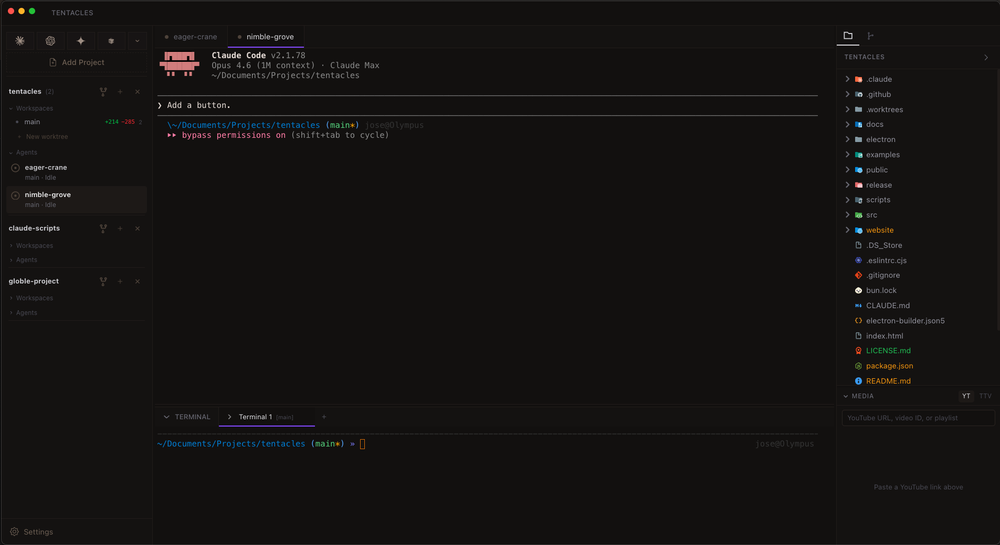

<p align="center">
  
</p>

<h1 align="center">Tentacles</h1>
<p align="center">An IDE for orchestrating multiple Claude Code agents across your projects</p>

<p align="center">
  <a href="https://github.com/jkrperson/tentacles/releases"></a>
  <a href="https://github.com/jkrperson/tentacles/stargazers"></a>
  <a href="https://discord.gg/8SFrcfhc"></a>
  <a href="LICENSE.md"></a>
</p>

<p align="center">
  <a href="#installation">Download</a> · <a href="https://discord.gg/8SFrcfhc">Discord</a> · <a href="https://github.com/jkrperson/tentacles/releases">Changelog</a> · <a href="https://github.com/jkrperson/tentacles/issues">Issues</a>
</p>

---

Tentacles lets you run as many Claude Code agents as you want from a single window. Each agent gets its own terminal. Each can be isolated in its own git worktree. You see what every agent is doing in real time, and you can resume any session with full history.

### Features

- **Parallel agents** — Spawn unlimited Claude Code sessions, each in its own terminal
- **Git worktree isolation** — One click to give an agent its own branch and working directory
- **Real-time status** — See what each agent is doing: reading, editing, thinking, or waiting
- **Session resume** — Pick up any past session with full conversation history
- **File explorer** — Browse your project with live updates and git status indicators
- **Code editor** — Tabbed Monaco editor with syntax highlighting
- **Shell terminals** — Regular terminals alongside your agents
- **Desktop notifications** — Know when an agent finishes or needs attention
- **Themes** — Obsidian, Midnight, Ember, and Dawn
- **Keyboard-driven** — `⌘T` new agent, `⌘1-9` switch, `⌘,` settings

---

## Installation

### macOS

| Chip | Download |
|:-----|:---------|
| Apple Silicon (M1/M2/M3/M4) | [Tentacles-Mac-arm64.dmg](https://github.com/jkrperson/tentacles/releases/latest/download/Tentacles-Mac-arm64.dmg) |
| Intel | [Tentacles-Mac-x64.dmg](https://github.com/jkrperson/tentacles/releases/latest/download/Tentacles-Mac-x64.dmg) |

Tentacles is not yet code-signed. macOS will block it on first launch. Fix it by running:

```bash
xattr -cr /Applications/Tentacles.app
```

Or right-click the app → "Open" → click "Open" in the dialog.

### Windows

[Tentacles-Windows-Setup.exe](https://github.com/jkrperson/tentacles/releases/latest/download/Tentacles-Windows-Setup.exe)

### Linux

[Tentacles-Linux.AppImage](https://github.com/jkrperson/tentacles/releases/latest/download/Tentacles-Linux.AppImage)

---

## Build from Source

```bash
git clone https://github.com/jkrperson/tentacles.git
cd tentacles
bun install
bun run dev
```

Requires [Bun](https://bun.sh/) v1.0+, [Claude Code CLI](https://docs.anthropic.com/en/docs/claude-code), Git 2.20+, and Node.js 18+.

To package: `bun run build` — output goes to `release/`.

---

## Usage

1. **Add a project** — Click "Add Project" in the sidebar and pick a folder
2. **Start an agent** — Click "+" or press `⌘T`
3. **Use worktrees** — Click the dropdown next to "+" to isolate an agent in its own branch
4. **Browse files** — File tree updates live as agents make changes
5. **Resume sessions** — Completed agents move to "Recent" — click to resume

---

## Tech Stack

Electron · React · TypeScript · Tailwind CSS v4 · Vite · tRPC · Monaco · xterm.js · Zustand · node-pty

---

## Contributing

Contributions welcome. Fork, branch, PR — or just [open an issue](https://github.com/jkrperson/tentacles/issues).

## Community

[Discord](https://discord.gg/8SFrcfhc) · [GitHub Issues](https://github.com/jkrperson/tentacles/issues)

## License

[Elastic License 2.0 (ELv2)](LICENSE.md)
